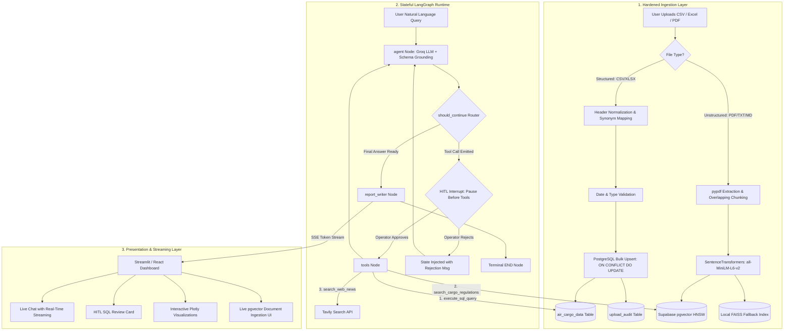

# ✈️ AIR-treides: The Complete Interview Playbook & Master Explanation Guide

> **Project Name**: AIR-treides (Enterprise AI Cargo Intelligence & Dual-Engine RAG Platform)  
> **Target Roles**: AI Engineer, Full-Stack AI Engineer, Backend/Distributed Systems Intern (SanDisk / Enterprise Tier)  
> **Tech Stack**: Python, LangGraph (`StateGraph`), Groq LLMs (`qwen/qwen3.8-27b`), Supabase / Amazon RDS (`pgvector` with HNSW), FAISS, SentenceTransformers (`all-MiniLM-L6-v2`), SQLAlchemy, Tavily API, Streamlit/React, AWS (EC2, RDS, S3), Pytest.

---

## 📑 Master Navigation
1. [The 3-Tier Pitch Strategy (30s / 90s / 3min)](#1-the-3-tier-pitch-strategy)
2. [The Problem Statement & Business Justification](#2-the-problem-statement--business-justification)
3. [Deep-Dive Architecture: How to Explain Every Layer](#3-deep-dive-architecture-how-to-explain-every-layer)
4. [The 2-Minute Whiteboard Drawing Blueprint](#4-the-2-minute-whiteboard-drawing-blueprint)
5. [Top 25 Technical & System Design Interview Questions with STAR Answers](#5-top-25-technical--system-design-interview-questions-with-star-answers)
6. [Tough "Trap" Questions & How to Counter Them](#6-tough-trap-questions--how-to-counter-them)
7. [The Closing Mic-Drop Summary](#7-the-closing-mic-drop-summary)

---

## 1. The 3-Tier Pitch Strategy

### ⚡ Tier 1: The 30-Second Elevator Hook (Use during "Tell me about yourself")
> *"One of my flagship projects is **AIR-treides**, an enterprise-grade AI decision-support platform for air cargo operations. I built a stateful **ReAct cyclic agent using LangGraph** that acts as a dual-engine brain: querying structured operational metrics in **PostgreSQL via Text-to-SQL**, and retrieving unstructured airline handling SOPs and IATA compliance manuals via **Supabase `pgvector` with a local FAISS fallback**. To make it production-ready, I built an idempotent ETL upsert pipeline, a Human-in-the-Loop review gate for SQL execution, and full token streaming on an AWS-backed architecture."*

---

### 🎙️ Tier 2: The 90-Second Comprehensive Pitch (Use for "Walk me through this project")
> *"I built **AIR-treides** to solve a critical bottleneck in air cargo logistics: data fragmentation between operational numbers (tonnage, flight records) and regulatory documents (temperature guidelines, lithium battery rules, airline SOPs).*
> 
> *Rather than building a basic single-turn chatbot, I engineered a **stateful cyclic agent using LangGraph StateGraph** powered by Groq LPU inference.*
> 
> *The system features a **Dual-Engine Data Architecture**:*
> 1. *For **Structured Metrics**, the agent generates read-only SQL queries against PostgreSQL to compute aggregations, market shares, and Month-over-Month volume trends.*
> 2. *For **Unstructured Rules**, I built a production RAG pipeline using **SentenceTransformers** and **Supabase `pgvector` with HNSW indexing**, backed by an automated **FAISS standby fallback** to retrieve airline SOPs and IATA compliance standards with sub-second latency.*
> 
> *To harden the backend for production:*
> * *I built an ETL ingestion pipeline with **synonym normalization** and PostgreSQL **`ON CONFLICT DO UPDATE` (Upsert)** to eliminate duplicate records during file re-uploads.*
> * *I introduced a **Human-in-the-Loop (HITL)** execution interrupt that freezes the state machine before any SQL query executes, giving operators a one-click review card.*
> * *I added regex-based SQL injection guardrails, multi-turn conversation memory with `MemorySaver`, and deployed containerized services on AWS."*

---

### 🏛️ Tier 3: The 3-Minute Architectural Deep-Dive (Use for System Design Rounds)
*(Deliver this while sketching the 3 layers on a whiteboard — see Section 4).*

---

## 2. The Problem Statement & Business Justification

### 🚨 The Real-World Industry Problem
Air cargo logistics managers make high-stakes operational decisions every minute. They face three chronic pain points:
1. **Siloed Numbers vs. Siloed Policies**: A manager wants to know *"Can we ship 500kg of Pfizer vaccines on Qatar Airways flight QR814 tomorrow?"*
   * Answering this requires checking **flight capacity metrics** in a database AND checking **pharma cold-chain temperature SOPs (+2°C to +8°C)** in a 50-page PDF manual.
2. **Fragile Data Ingestion**: Field operators upload messy CSV/Excel spreadsheets with varying header names (`carrier` vs `airline_name`), causing duplicate rows or database crashes upon re-upload.
3. **AI Hallucination & Security Risks**: Unconstrained LLMs writing SQL can hallucinate column names or execute destructive statements (`DROP`, `DELETE`).

### 💡 How AIR-treides Solves It
* **Dual-Engine Intelligence**: Combines **Text-to-SQL** for quantitative math + **Vector RAG (`pgvector` + FAISS)** for qualitative rulebook lookups + **Tavily** for live disruption news.
* **Idempotent Ingestion**: Synonym normalization maps headers automatically; composite unique indexing executes atomic upserts.
* **Zero-Trust Safety**: Schema grounding prevents hallucinated columns; regex validators block mutating SQL; HITL pause gives operators manual control.

---

## 3. Deep-Dive Architecture: How to Explain Every Layer



### 🔹 Component-by-Component Walkthrough:

#### 1. The Ingestion Engine (`backend/ingestion.py` & `backend/vector_store.py`)
* **Structured Data**:
  * `COLUMN_MAPPING`: Maps synonyms like `carrier` $\rightarrow$ `airline`, `qty` $\rightarrow$ `weight_tons`.
  * `pd.to_datetime(..., errors="coerce")`: Rejects corrupt dates by converting to `NaT` and failing safely.
  * **PostgreSQL Upsert**: Employs `sqlalchemy.dialects.postgresql.insert` with `on_conflict_do_update` on the composite unique index `(month, airport_name, airline, commodity_type, export_import)`. Overlapping re-uploads update existing weights rather than duplicating.
* **Unstructured Data (PDF/Text RAG)**:
  * `extract_text_from_file`: Uses `pypdf` to extract text across pages.
  * `chunk_text`: Splits into 600-character chunks with 100-character overlap to preserve semantic context across sentence boundaries.
  * `get_embedding`: Generates unit-normalized 384-dim embeddings via `all-MiniLM-L6-v2`.
  * Dual-Registration: Writes to both Supabase `pgvector` (`cargo_guidelines` table) and memory `FAISSFallbackStore`.

#### 2. The Agentic State Machine (`backend/graph.py` & `backend/nodes.py`)
* **`AgentState`**: Defined as `TypedDict` where `messages: Annotated[Sequence[BaseMessage], add_messages]`. The `add_messages` reducer appends new turns and tool results to conversation memory without overwriting.
* **`agent` Node**: Injects `AGENT_SYSTEM_PROMPT` containing hardcoded schema grounding, few-shot examples, and tools binding (`execute_sql_query`, `search_cargo_regulations`, `search_web_news`).
* **`should_continue` Router**: Pure Python conditional edge checking `if last_message.tool_calls: return "tools" else: "report_writer"`.
* **Cyclic ReAct Loop**: `workflow.add_edge("tools", "agent")` creates the feedback loop where tool outputs re-enter the LLM for multi-step reasoning.
* **`MemorySaver`**: Checkpoints state per `thread_id` to enable persistent multi-turn conversations.

#### 3. Dual-Engine Vector Store (`backend/vector_store.py`)
* **Primary (Supabase `pgvector`)**:
  * Cosine distance operator (`<=>`) inside SQL `SELECT ... ORDER BY embedding <=> CAST(:vec AS vector) LIMIT :top_k`.
  * Indexed via **HNSW (Hierarchical Navigable Small World)** with `vector_cosine_ops` for $O(\log N)$ approximate nearest neighbor search.
* **Standby Fallback (Local FAISS)**:
  * `faiss.IndexFlatIP` (Inner Product on $L_2$-normalized vectors = exact Cosine Similarity).
  * Automatically catches network timeouts or database errors and answers queries with zero downtime.

#### 4. Safety Guardrails & HITL
* **Regex Injection Guard**: `is_safe_select` blocks `DROP`, `DELETE`, `UPDATE`, `INSERT`, `ALTER`, `TRUNCATE`, `GRANT`, `REVOKE`.
* **HITL Interrupt Gate**: `interrupt_before=["tools"]` pauses the graph. The UI renders the proposed SQL in an amber review card. If approved, `app.stream(None)` resumes; if rejected, `app.update_state` injects a rejection `ToolMessage` allowing the agent to self-correct.

---

## 4. The 2-Minute Whiteboard Drawing Blueprint

When an interviewer asks you to draw the architecture, sketch these 3 boxes top-to-bottom:

```
=======================================================================================================
                            1. INGESTION & ETL LAYER
=======================================================================================================
  [CSV/Excel File] ──► [Synonym Normalizer] ──► [Type Validation] ──► [Postgres Upsert ON CONFLICT]
                                                                                │
  [PDF Manuals]    ──► [pypdf + Chunking]   ──► [all-MiniLM-L6-v2] ──► [pgvector HNSW + FAISS Fallback]

=======================================================================================================
                            2. LANGGRAPH AGENT RUNTIME
=======================================================================================================
  [User Prompt] ────► ┌────────────────────────────────────────────────────────┐
                      │ 🧠 agent Node [Groq LLM + Schema Grounding]            │ ◄──────────┐
                      └──────────────────────────┬─────────────────────────────┘            │
                                                 │ (AIMessage)                              │
                                                 ▼                                          │
                      ┌────────────────────────────────────────────────────────┐            │
                      │ 🔀 should_continue Router [Python if/else]             │            │
                      └──────────────┬──────────────────────────┬──────────────┘            │
                                     │ (Tool Call)              │ (Done)                    │
                                     ▼                          ▼                           │
                      ┌──────────────────────────┐    ┌─────────────────────────┐           │
                      │ 🛑 HITL Interrupt Gate   │    │ 📝 report_writer Node   │           │
                      │ (Operator Review Card)   │    │ (Markdown Tables)       │           │
                      └──────────────┬───────────┘    └────────────┬────────────┘           │
                                     │ [Approved]                  │                        │
                                     ▼                             ▼                        │
                      ┌──────────────────────────┐             ┌───────┐                    │
                      │ 🛠️ tools Node            │             │  END  │                    │
                      │ 1. Text-to-SQL           │             └───────┘                    │
                      │ 2. pgvector / FAISS RAG  ├──────────────────────────────────────────┘
                      │ 3. Tavily Web News       │              (Loop back to Agent)
                      └──────────────────────────┘

=======================================================================================================
                            3. PRESENTATION & CLOUD LAYER
=======================================================================================================
  [Streamlit / React UI] ◄── (SSE Token Streaming)
  • Real-time Chat Stream  • HITL Approval Action  • Interactive Plotly Charts  • Live PDF Ingestion UI
  • Hosted on AWS EC2 + Amazon RDS PostgreSQL (pgvector) + Amazon S3
```

---

## 5. Top 25 Technical & System Design Interview Questions with STAR Answers

### 🧠 Group A: LangChain, LangGraph & Agentic Systems

#### Q1: Why did you choose LangGraph instead of a linear LangChain Expression Language (LCEL) chain?
* **Answer**: *"LCEL chains execute as Directed Acyclic Graphs (DAGs)—they only flow in one direction ($A \rightarrow B \rightarrow C$). If a generated SQL query contains a database syntax error or invalid column name, an LCEL chain immediately fails. LangGraph compiles a **cyclic StateGraph ($A \rightarrow B \rightarrow A$)**. When a tool returns an error message, control loops back to the agent node so the LLM can analyze the error, rewrite the SQL query, and self-correct autonomously."*

#### Q2: What is the purpose of `Annotated[Sequence[BaseMessage], add_messages]` in `AgentState`?
* **Answer**: *"In Python `TypedDict`, updating a state dictionary key overwrites the previous value. `add_messages` is a **reducer function**. It inspects incoming messages: if the message has a new unique `id`, it appends it to the conversation history; if an existing `id` matches, it updates the message in-place. This ensures conversation and tool history are preserved across multi-turn cycles."*

#### Q3: How does Human-in-the-Loop (HITL) work under the hood in your LangGraph implementation?
* **Answer**: *"We compile the graph with `interrupt_before=['tools']`. When the agent node produces an `AIMessage` containing a tool call, LangGraph freezes execution right before entering the `tools` node and persists the state in `MemorySaver`. The UI detects `state.next == ('tools',)` and renders an amber approval card displaying the raw SQL query. If approved, we call `app.stream(None)` to resume execution. If rejected, we call `app.update_state` to inject a rejection `ToolMessage`, allowing the agent to explain the rejection without executing unauthorized queries."*

#### Q4: What is `MemorySaver` and how would you scale it for enterprise production?
* **Answer**: *"In our prototype, `MemorySaver` is an in-memory checkpointer that snapshots the graph's `AgentState` in RAM keyed by `thread_id`. For enterprise scale (e.g. thousands of concurrent users or multi-pod Kubernetes deployments), we swap `MemorySaver` with **`PostgresSaver`** or **`RedisSaver`**. This ensures state persistence across pod restarts, horizontal worker scaling, and zero state loss."*

#### Q5: How do you prevent an agent from entering an infinite execution loop?
* **Answer**:
1. Pass a `recursion_limit` in the runtime configuration: `config={"recursion_limit": 10}`.
2. Implement cycle detection in the `should_continue` router to abort if identical tool arguments repeat 3 times.
3. System prompt constraints instructing the agent to provide its best estimate if tools fail twice.

---

### 📚 Group B: RAG, Embeddings & Vector Databases

#### Q6: How does your Dual-Engine RAG system work and why did you pair `pgvector` with FAISS?
* **Answer**: *"Our primary vector store is **Supabase `pgvector`**, using a `vector(384)` column indexed with **HNSW (`vector_cosine_ops`)**. To ensure enterprise-grade resilience, we paired it with a local **FAISS in-memory fallback (`IndexFlatIP`)**. When documents or PDFs are uploaded, embeddings generated by `all-MiniLM-L6-v2` are registered in both stores. If Supabase encounters network latency or downtime, the search function automatically falls back to FAISS, guaranteeing zero-downtime retrieval of airline SOPs and compliance manuals."*

#### Q7: Why did you choose `all-MiniLM-L6-v2` over OpenAI's `text-embedding-3-small`?
* **Answer**: *"`all-MiniLM-L6-v2` produces compact 384-dimensional vectors with high semantic density. Because it runs locally via `SentenceTransformers` on CPU in ~15 milliseconds, it incurs **zero API costs**, has **zero network latency**, and avoids third-party rate limits. For enterprise domain terms, 384 dimensions provide optimal cosine separation without inflating database RAM footprint."*

#### Q8: What is HNSW and why is it preferred over IVFFlat or Flat vector search?
* **Answer**:
* **Flat Search**: Brute-force $O(N)$ comparison. 100% recall, but becomes unusable as datasets grow into millions of vectors.
* **IVFFlat (Inverted File Flat)**: Clusters vectors into Voronoi cells. Fast, but requires periodic re-training as new data is inserted.
* **HNSW (Hierarchical Navigable Small World)**: Constructs a multi-layer graph where top layers have long-range skips and bottom layers have dense local links. It achieves approximate nearest neighbor (ANN) search in **$O(\log N)$ time with >98% recall**, supporting real-time insertions without re-indexing from scratch.

#### Q9: What chunking strategy did you use for air cargo compliance manuals?
* **Answer**: *"We implemented a **sliding-window paragraph chunker** with a chunk size of 600 characters and a 100-character overlap. Chunking strictly by paragraph boundaries preserves complete regulatory statements (e.g. packaging rules, temperature limits). The 100-character overlap ensures that sentences crossing chunk boundaries do not lose crucial context like 'NOT exceeding 30% State of Charge'."*

#### Q10: How would you implement Hybrid Search in this platform?
* **Answer**: *"We combine **Dense Vector Retrieval** (embeddings for semantic concepts like 'cold chain vaccine handling') with **Sparse BM25 Keyword Search** (exact matching for UN numbers like `UN 3480` or airline IATA codes like `QR`/`EK`). We then merge and rank the candidate documents using **Reciprocal Rank Fusion (RRF)**: $RRF(d) = \sum \frac{1}{60 + rank(d)}$, ensuring both semantic intent and exact codes are prioritized."*

---

### 🗄️ Group C: Database, SQL & Ingestion Engineering

#### Q11: Explain your idempotent PostgreSQL Upsert mechanism.
* **Answer**: *"Traditional data pipelines crash or create duplicate rows when an overlapping CSV is re-uploaded. We defined a composite unique index on `(month, airport_name, airline, commodity_type, export_import)`. During ingestion, we build an atomic `sqlalchemy.dialects.postgresql.insert` statement with `on_conflict_do_update`, setting `weight_tons = EXCLUDED.weight_tons`. This ensures that re-uploading an updated dataset updates existing weights cleanly without duplicate rows."*

#### Q12: How does the ingestion pipeline handle messy or inconsistent spreadsheet headers?
* **Answer**: *"We built a **Synonym Normalization Mapper** (`COLUMN_MAPPING`). Varied industry naming conventions (e.g. `carrier`, `airline_name`, `operator` $\rightarrow$ `airline`; `qty`, `metric_tons` $\rightarrow$ `weight_tons`) are automatically resolved to our canonical database schema before data validation."*

#### Q13: How do you protect the PostgreSQL database against SQL Injection?
* **Answer**: *"We implement defense-in-depth across 3 layers:*
1. *Application-Level Regex Validator: `is_safe_select` verifies the query starts with `SELECT` and blocks forbidden keywords (`DROP`, `DELETE`, `UPDATE`, `INSERT`, `ALTER`, `TRUNCATE`, `GRANT`).*
2. *Human-in-the-Loop Review: Execution freezes before the tools node for operator inspection.*
3. *Database Role Permissions: In production, the LLM database connection uses a dedicated PostgreSQL role granted strictly `SELECT` permissions on `air_cargo_data`."*

#### Q14: What is Connection Pooling and why is PgBouncer essential here?
* **Answer**: *"Opening direct PostgreSQL connections incurs SSL handshakes and memory process overhead (~10MB per connection). When dozens of users stream LLM responses simultaneously, direct connections quickly exhaust PostgreSQL's `max_connections`. PgBouncer acts as a lightweight proxy, maintaining a pool of warm database connections and sharing them among transactions, scaling throughput from 50 to 5,000+ concurrent requests."*

---

### ⚙️ Group D: Backend, Async & Cloud Systems (AWS / SanDisk Scale)

#### Q15: How does asynchronous programming improve performance in AI agent backends?
* **Answer**: *"AI workloads are I/O-bound (waiting on LLM tokens, database queries, and web APIs). Using Python's `asyncio` and `asyncio.gather()`, we can fire independent tool tasks (e.g. querying Tavily web news and querying PostgreSQL) concurrently. This reduces total latency from $T_{SQL} + T_{News}$ to $\max(T_{SQL}, T_{News})$ without blocking the main event loop."*

#### Q16: How did you design the AWS cloud deployment for AIR-treides?
* **Answer**:
* **Compute (AWS EC2 / ECS)**: Dockerized container running the Python LangGraph runtime and Streamlit/FastAPI backend.
* **Relational & Vector Database (Amazon RDS PostgreSQL)**: Multi-AZ PostgreSQL instance with the `pgvector` extension enabled for both operational tables and HNSW vector indexes.
* **Object Storage (Amazon S3)**: Secure storage bucket for raw user-uploaded compliance PDFs, Excel sheets, and immutable audit logs.

#### Q17: How does token streaming work over Server-Sent Events (SSE)?
* **Answer**: *"The backend establishes a persistent HTTP connection with headers `Content-Type: text/event-stream` and `Cache-Control: no-cache`. In `stream_report_writer`, we invoke `llm.stream()`, yielding incremental token chunks formatted as `data: {"token": "..."}\n\n`. The frontend consumes the stream via a readable stream reader, rendering words in real-time to eliminate perceived latency."*

#### Q18: What is Model Context Protocol (MCP) and how does it apply to this project?
* **Answer**: *"MCP is an open standard that decouples AI models from proprietary tool integrations via a standardized JSON-RPC protocol. Instead of writing custom tool wrappers for every framework, we can wrap our `execute_sql_query` and `search_cargo_regulations` tools into an **MCP Server**. Any MCP client (Claude Desktop, Cursor, IDEs, or enterprise agents) can dynamically discover and execute our cargo tools out-of-the-box."*

---

## 6. Tough "Trap" Questions & How to Counter Them

### 💣 Trap 1: *"Why not just put the entire cargo database into the LLM context window?"*
* **The Trap**: Checking if you understand token economics, context window limits, and aggregation math.
* **Winning Counter**:
  > *"Air cargo databases contain millions of rows across years of telemetry. Passing millions of rows into a context window would cost thousands of dollars per query, exceed context limits, and cause severe needle-in-a-haystack attention loss. Furthermore, LLMs cannot perform reliable mathematical aggregations (like standard deviations or sums over 100,000 rows). Relational SQL engines are built for deterministic math; LLMs are built for natural language reasoning. Text-to-SQL gives us the best of both worlds."*

---

### 💣 Trap 2: *"What if the user uploads a 1,000-page PDF manual—will your server crash?"*
* **The Trap**: Testing your understanding of async background processing and memory constraints.
* **Winning Counter**:
  > *"In our current architecture, `pypdf` streams pages sequentially and chunks text into memory generators without loading the entire parsed tree at once. For production enterprise scale, we decouple ingestion from the web thread: the file is uploaded to Amazon S3, triggering an asynchronous worker queue (Celery / AWS SQS) that processes, embeds, and batch-inserts chunks into `pgvector` in the background with progress webhooks."*

---

### 💣 Trap 3: *"What was the most challenging bug you solved while building this project?"*
* **Winning Counter (The Model Deprecation & Dynamic Fallback Bug)**:
  > *"During LLM integration with Groq, our agent threw an unexpected `HTTP 404 Model Not Found` when a hardcoded model endpoint changed. Rather than simply changing the string, I re-architected `_get_llm()` to decouple model selection via environment variables (`GROQ_MODEL`) with graceful fallback handling. I then wrote an automated `pytest` suite covering model binding, graph routing, and tool execution to ensure zero downtime across API version upgrades."*

---

## 7. The Closing Mic-Drop Summary

When the interview is wrapping up and they ask if you have any final thoughts:

> *"To summarize: **AIR-treides** is not just an AI demo—it's a production-ready **Dual-Engine Decision Platform**.  
> It uses **LangGraph StateGraph** for cyclic reasoning, **Supabase `pgvector` with HNSW & FAISS** for zero-downtime RAG, **PostgreSQL Upserts** for hardened ETL, and **Human-in-the-Loop review** for enterprise security.  
> 
> I am excited to bring this exact mindset of building reliable, scalable, and secure AI agent infrastructure to the engineering team at SanDisk."* 🚀
