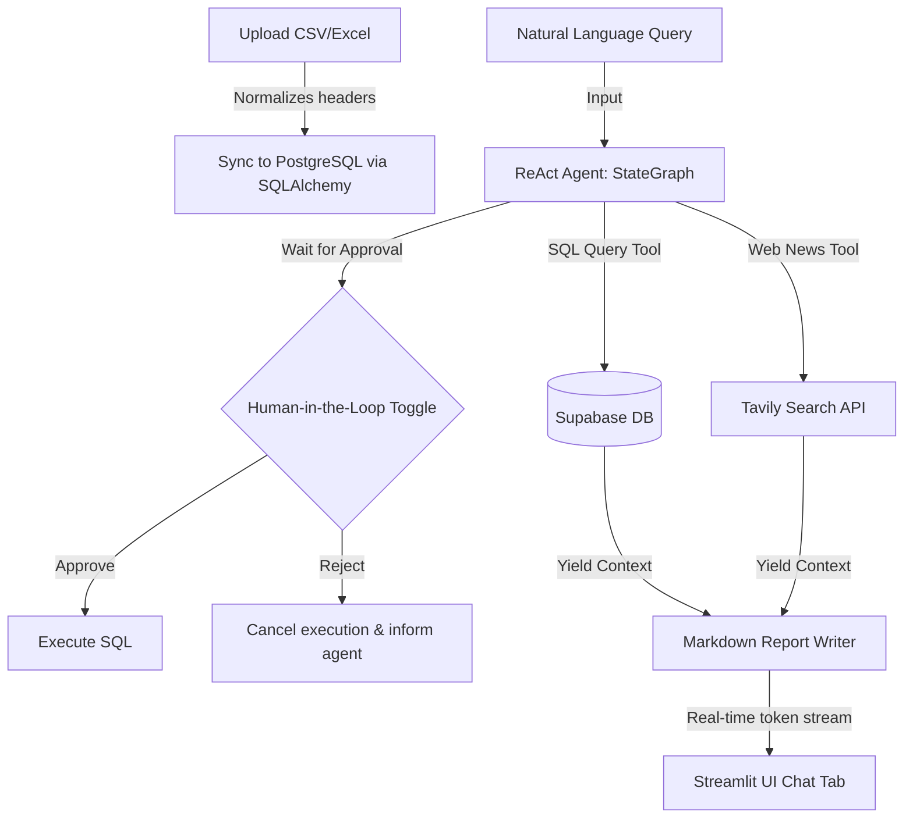

# AIR-treides — Comprehensive Technical Manual & Placement Interview Guide

This reference manual is designed to prepare you for college placement interviews, software engineering reviews, and architecture discussions. It breaks down every design pattern, technical choice, and feature of the **AIR-treides Cargo Intelligence Platform**.

---

## 1. Project Overview & Rebranding
The platform is named **AIR-treides** (inspired by noble house Atreides, representing foresight, precision, and leadership in logistics and navigation). It is an enterprise-grade AI decision-support system for air cargo operations.

---

## 2. Technical Stack Breakdown

*   **Frontend UI**: **Streamlit** (Python). Integrated with custom CSS style injections to overlay standard elements with a premium, high-contrast burgundy (`#8D1B3D`) and gold (`#C49A45`) palette. Features a tab-based view (`AI Assistant` vs `Live Operations Dashboard`).
*   **Orchestration Framework**: **LangGraph (StateGraph)**. Chosen over basic LangChain wrappers to enable cyclic execution loops (ReAct pattern) and state management.
*   **Workflow Checkpointing**: **LangGraph MemorySaver**. Implemented inside [graph.py](file:///d:/AgenticAI/air-cargo-intelligence/backend/graph.py) to snapshot conversation states at each execution boundary.
*   **Inference Engine**: **Groq Cloud API** running **`qwen/qwen3-32b`**. Provides high-speed token output necessary for real-time text-to-SQL generation.
*   **Search Engine**: **Tavily Search API**. Optimized for LLMs to retrieve context-relevant air cargo news and disruptions.
*   **Database & Storage**: **Supabase PostgreSQL & SQLAlchemy**. Supabase hosts the relational tables (`air_cargo_data` and `upload_audit`), while SQLAlchemy manages connections and upsert dialect transactions.

---

## 3. Core Features & Use Cases

### A. Real-Time Operations Cockpit (Analytics Dashboard)
Instead of relying solely on chat, the dashboard gives immediate visual context:
- **KPI Cards**: Displays total tonnage, flight records count, active airlines, and hubs.
- **Plotly Charts**: Line chart for Month-over-Month volume trends, horizontal bar chart for top 10 airlines, and donut chart for import vs. export ratios.
- **Data Preview & Audit logs**: Shows the latest rows inside `air_cargo_data` and upload history inside `upload_audit`.

### B. Ingestion Hardening (Upsert Mode)
- Traditional data syncs cause duplicates or database constraint crashes.
- **AIR-treides** features an **Upsert Ingestion Mode** that runs a PostgreSQL `INSERT ... ON CONFLICT` statement on the unique index `(month, airport_name, airline, commodity_type, export_import)`. When files with overlapping data are re-uploaded, it updates the weights instead of adding duplicate records.

### C. Human-in-the-Loop SQL Review (HITL)
- Protects relational databases from incorrect SQL executions.
- Before entering the `tools` execution step, the StateGraph pauses execution. The UI renders the proposed query inside a warning card. The operator can **Approve & Run** (resuming the workflow) or **Reject** (intercepting the flow and reporting errors back to the agent).

---

## 4. Scaling, Commercial Value, & Agent Challenges

### Scaling the Architecture
When handling millions of cargo records and thousands of concurrent requests:
1. **Connection Pooling**: Use **PgBouncer** in front of Supabase to prevent connection exhaustion.
2. **Read/Write Split**: Route bulk CSV file ingestion to a primary write instance, and agent SELECT queries to read replicas.
3. **Caching**: Place a **Redis** cache in front of repetitive database queries to speed up general questions.
4. **Time-Series Partitioning**: Partition the `air_cargo_data` table by month/quarter to keep index scans fast.

### Commercial & Business Value
- **Reduced Latency**: Reduces standard shipping dashboard generation times from hours to seconds.
- **Operational Agility**: Lets logistics managers instantly overlay internal cargo bottlenecks with external web news (e.g., flight bans, weather delays).

### Mitigating AI Agent Challenges

> [!WARNING]
> **1. SQL Hallucinations**
> *   *Problem*: The LLM queries columns or tables that do not exist.
> *   *Mitigation*: We ground the agent by hardcoding the exact database schema columns inside the system prompt in [nodes.py](file:///d:/AgenticAI/air-cargo-intelligence/backend/nodes.py).

> [!CAUTION]
> **2. SQL Injection & Destructive Query Risks**
> *   *Problem*: A malicious input might trigger a database drop or data modification.
> *   *Mitigation*: We enforce a select-only validator [is_safe_select](file:///d:/AgenticAI/air-cargo-intelligence/backend/nodes.py#L75-L82) using case-insensitive regex pattern checks against keywords like `DROP`, `DELETE`, `UPDATE`, `INSERT`, and `ALTER`.

> [!NOTE]
> **3. Context Drift & Token Limits**
> *   *Problem*: Conversational history grows too large, causing LLM attention loss and hitting Groq API token limits.
> *   *Mitigation*: We trim conversation memory history to the latest 10 messages (`MAX_HISTORY = 10`) while keeping the system prompt static at the front of every prompt payload.

---

## 5. Architectural Improvements
1. **Vector Integration (RAG)**: Introduce `pgvector` into Supabase to store shipping manuals and policy documents. Add a vector search tool so the agent can check regulatory text along with database stats.
2. **Async Task Queues**: Offload bulk Excel ingestion to a Celery background worker to prevent Streamlit session timeouts during large uploads.

---

## 6. 30 Placement Interview Questions & Answers

### Group A: System & Agentic Workflows
#### Q1: What is a ReAct (Reasoning + Acting) pattern?
- **Answer**: It is a loop design where an agent alternates between reasoning (analyzing conversation history to plan next steps) and acting (invoking external tools like database execution or Tavily search) before generating a final response.

#### Q2: What is the main benefit of LangGraph over linear DAG frameworks like LangChain Expression Language (LCEL)?
- **Answer**: Linear DAG frameworks cannot handle cyclic loops. LangGraph supports cyclic StateGraphs where nodes can loop back to preceding nodes dynamically (e.g., if a tool output contains a SQL error, the agent can loop back to rewrite the query).

#### Q3: How does MemorySaver function in LangGraph?
- **Answer**: It is an in-memory checkpointer that snapshots the graph's `AgentState` after each node execution. By passing a configurable `thread_id`, the system loads the matching state, enabling stateful conversation memory.

#### Q4: Why does our StateGraph compile with `interrupt_before=["tools", "report_writer"]`?
- **Answer**: This specifies execution boundaries. Interrupting before `tools` pauses the workflow, allowing human operators to review proposed queries (HITL). Interrupting before `report_writer` lets the Streamlit frontend capture and stream outputs token-by-token.

#### Q5: If the Streamlit application restarts, is the MemorySaver state preserved?
- **Answer**: No, `MemorySaver` stores state in volatile server RAM. For persistent memory across restarts, we must swap it for a persistent checkpointer like `PostgresSaver`.

#### Q6: Explain the role of the `add_messages` annotator in `AgentState`.
- **Answer**: It is a reducer function. Instead of overwriting the message history when a node returns a new message, it appends the new message or updates existing ones by ID.

---

### Group B: Database, Ingestion, & Upserts
#### Q7: Why does `get_safe_db_url` URL-encode the database password?
- **Answer**: Supabase database passwords contain special URL characters (e.g. `#`, `%`). Without URL-encoding, SQLAlchemy misinterprets these characters as protocol or port separators, leading to connection failures.

#### Q8: How is the "Upsert" ingestion mechanism implemented in python?
- **Answer**: We use the PostgreSQL-specific dialect of SQLAlchemy (`sqlalchemy.dialects.postgresql.insert`). It builds an `on_conflict_do_update` statement referencing key columns. If a unique index violation occurs, it updates the weight value rather than crashing or duplicating.

#### Q9: What table acts as a log for files uploaded, and how is it updated?
- **Answer**: The `upload_audit` table. Inside [ingestion.py](file:///d:/AgenticAI/air-cargo-intelligence/backend/ingestion.py), every successful upload logs the filename, count of rows, and current timestamp.

#### Q10: How does the ingestion pipeline handle synonyms in header rows?
- **Answer**: We map variations (synonyms) like `carrier` or `airline_name` to a canonical name `airline` using a mapped column dictionary (`COLUMN_MAPPING`).

#### Q11: What occurs if a cell in the CSV file has an invalid date?
- **Answer**: `pd.to_datetime(..., errors="coerce")` converts the invalid cell to `NaT`. The script detects this null value and immediately aborts the transaction, returning an error message to prevent corrupt records.

#### Q12: Why do we use chunks of 1000 records when performing a bulk upsert?
- **Answer**: To prevent hitting PostgreSQL's parameter limit. Inserting too many rows in a single query can exceed the maximum query parameters allowed in a database driver.

---

### Group C: Prompting, Few-Shot, & Safety
#### Q13: What are few-shot examples, and why are they added to our system prompt?
- **Answer**: They are mock historical message exchanges injected into the prompt. They teach the LLM to write structured tool calls using exact JSON formats, preventing syntax errors.

#### Q14: Explain the difference between `AGENT_SYSTEM_PROMPT` and `REPORT_SYSTEM_PROMPT`.
- **Answer**: The Agent prompt guides the LLM on tool usage, database schemas, and routing. The Report prompt is focused purely on stylistic formatting (generating markdown tables and reports).

#### Q15: How does the `is_safe_select` guardrail block SQL Injection?
- **Answer**: It verifies the query starts with the case-insensitive keyword `SELECT` and uses a regex pattern to block mutating keywords (e.g. `DROP`, `DELETE`, `UPDATE`, `INSERT`, and `ALTER`).

#### Q16: How do we prevent the system prompt from being forgotten as the chat history grows?
- **Answer**: We prepend the static `SystemMessage` to the front of the chat history array during every LLM invocation, ensuring instructions are never forgotten.

#### Q17: What is the risk of having too many few-shot examples in a prompt?
- **Answer**: It consumes the context window, increases token processing costs, slows response speed, and can trigger API rate limits.

#### Q18: What is "grounding" in Text-to-SQL agents?
- **Answer**: It is providing the exact schema (tables and columns) in the system instructions so the model does not query hypothetical schema configurations.

---

### Group D: Scaling & Enterprise Engineering
#### Q19: What is connection pooling, and why is PgBouncer used in Supabase?
- **Answer**: Opening PostgreSQL database connections is computationally expensive. PgBouncer keeps a pool of warm connections active, sharing them among users to scale database throughput.

#### Q20: Explain database partitioning by time.
- **Answer**: It divides a table into child tables based on date boundaries (e.g., month). Scans are restricted to the relevant partition, keeping lookups fast as datasets grow.

#### Q21: What is a Redis cache, and how does it help scaling?
- **Answer**: It is an in-memory database. By storing key-value pairs of queries and results, it bypasses the LLM and relational database for identical questions.

#### Q22: What is the benefit of using read replicas?
- **Answer**: They duplicate data to separate server instances. It scales performance by routing heavy reads to replica databases, leaving the master database available for writes.

#### Q23: Why do we use `method="multi"` in Pandas `to_sql`?
- **Answer**: It batches multiple rows into a single `INSERT` statement, which significantly reduces network roundtrips and speeds up file ingestion.

#### Q24: What is the risk of using module-level global variables in Streamlit?
- **Answer**: Streamlit runs a single server process with threads for each user. Global variables are shared across all user threads, leading to data leaks between sessions.

---

### Group E: Advanced AI Agent Security & Reliability
#### Q25: How does the agent recover from Groq HTTP 429 (Rate Limit Exceeded) errors?
- **Answer**: We implement a retry block in the `agent` node. If an exception is caught, the loop waits and retries the call. In production, this should include an exponential backoff with jitter.

#### Q26: How would you test the accuracy of a Text-to-SQL agent?
- **Answer**: By running an evaluation dataset of 100 questions. The agent's generated SQL queries are run on a mock database and compared to golden-standard SQL results.

#### Q27: How does `app.update_state` allow custom HITL rejections?
- **Answer**: When the operator clicks "Reject", `app.update_state` inserts a `ToolMessage` with a rejection description at the current node state (`tools`), instructing the agent that the action was cancelled.

#### Q28: What is "context window drift" in LLMs?
- **Answer**: It occurs when older conversation logs get discarded as the conversation length exceeds the maximum token context limit, causing the model to lose track of earlier turns.

#### Q29: What is the role of Tavily Search API in this system?
- **Answer**: It acts as a search engine optimized to return clean content snippets for LLMs rather than noisy HTML pages.

#### Q30: How would you add user auth and multi-tenancy?
- **Answer**: Integrate authentication (e.g., Supabase Auth) and add a `tenant_id` column to tables, filtering all database queries to isolate user datasets.
