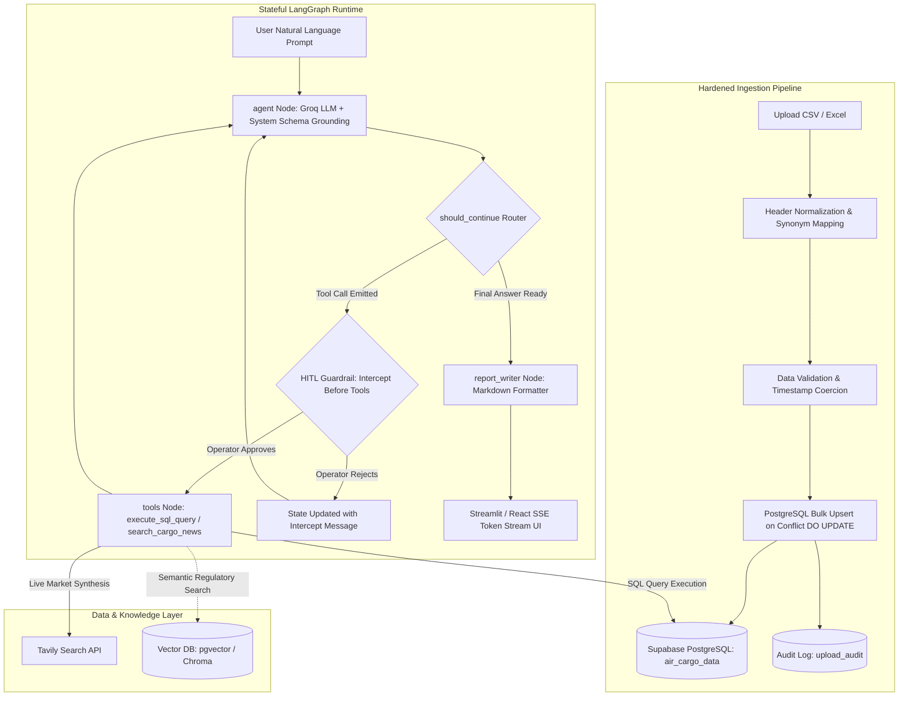
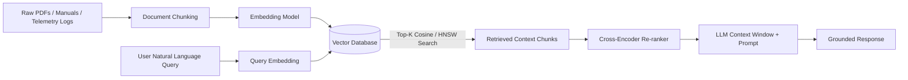
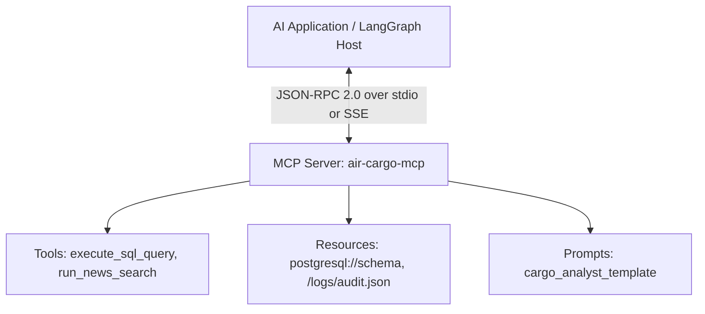

# 🚀 SanDisk (Western Digital) AI Engineer Intern — Complete Interview & Project Master Guide

> **Target Role**: AI Engineer Intern (Full-Stack Backend-Heavy + Applied AI, 9–10 Months, Bangalore)  
> **Project Analyzed**: **AIR-treides — Enterprise Cargo Intelligence & Analytics Platform**  
> **Core Tech Stack**: LangGraph, LangChain, Groq LLMs, Supabase PostgreSQL, Vector DBs, RAG, MCP, Python (Async), React/Next.js & Streamlit, Plotly, Pytest.

---

## 📑 Table of Contents
1. [60-Second Elevator Pitch & System Architecture](#1-60-second-elevator-pitch--system-architecture)
2. [LangChain & LangGraph Masterclass (Agentic Workflows)](#2-langchain--langgraph-masterclass-agentic-workflows)
3. [RAG Pipelines, Chunking, & Vector Databases](#3-rag-pipelines-chunking--vector-databases)
4. [Model Context Protocol (MCP) Deep Dive](#4-model-context-protocol-mcp-deep-dive)
5. [Backend & Systems Engineering (Python Async, SQL, MongoDB)](#5-backend--systems-engineering-python-async-sql-mongodb)
6. [Streaming (SSE/WebSockets), Next.js & Frontend Dashboards](#6-streaming-ssewebsockets-nextjs--frontend-dashboards)
7. [Hardened Ingestion, Security Guardrails & Testing](#7-hardened-ingestion-security-guardrails--testing)
8. [40+ SanDisk Interview Questions & Star Answers](#8-40-sandisk-interview-questions--star-answers)
9. [Behavioral & "Why SanDisk" Framework](#9-behavioral--why-sandisk-framework)

---

## 1. 60-Second Elevator Pitch & System Architecture

### 🎙️ The 60-Second Interview Pitch
> *"I built **AIR-treides**, an enterprise-grade AI Cargo Intelligence platform that bridges autonomous decision-making with operational analytics. Rather than building a fragile single-turn chatbot, I engineered a stateful **ReAct (Reasoning + Acting) cyclic agent using LangGraph**.*
> 
> *The system autonomously determines whether to query live operational telemetry in **PostgreSQL via Text-to-SQL**, search real-time global news via **Tavily**, or synthesize executive markdown reports. To make it production-ready, I built a hardened ETL ingestion pipeline with synonym normalization and idempotent PostgreSQL upserts, an execution interception card for **Human-in-the-Loop (HITL)** SQL review, and regex-based SQL safety guardrails.*
> 
> *The frontend features an interactive real-time analytics dashboard powered by Plotly with full token streaming, backed by an in-memory checkpointer for multi-turn state persistence."*

---

### 📐 End-to-End System Architecture Diagram



---

## 2. LangChain & LangGraph Masterclass (Agentic Workflows)

### 🔹 Linear Chains (LCEL) vs Cyclic Graphs (LangGraph)
| Dimension | Traditional LangChain / LCEL | LangGraph (Our Choice in AIR-treides) |
| :--- | :--- | :--- |
| **Execution Topology** | Directed Acyclic Graph (DAG) — One-way pipeline ($A \rightarrow B \rightarrow C$). | **Cyclic State Machine** — Nodes can loop back ($A \rightarrow B \rightarrow A$) until a goal condition is satisfied. |
| **Error Recovery** | Fails on runtime errors unless hardcoded fallbacks exist. | **Self-Correction**: If a generated SQL query errors, the tool output is routed back to the LLM to analyze the error and rewrite the query. |
| **State Management** | Ephemeral, passed as simple dictionaries. | **Structured `AgentState`** with explicit reducers (`add_messages`) and checkpointing. |
| **Human-in-the-Loop** | Difficult to pause/resume mid-chain. | **Native Interrupts** (`interrupt_before`, `interrupt_after`) with state inspection & mutation. |

---

### 🔹 StateGraph Architecture in `backend/graph.py`

```python
# State Definition with Reducer
class AgentState(TypedDict):
    messages: Annotated[list[BaseMessage], add_messages]

# Building the Graph
workflow = StateGraph(AgentState)
workflow.add_node("agent", agent)
workflow.add_node("tools", run_tools)
workflow.add_node("report_writer", report_writer)

workflow.set_entry_point("agent")

# Dynamic Routing
workflow.add_conditional_edges(
    "agent",
    should_continue,
    {"tools": "tools", "report_writer": "report_writer"}
)
workflow.add_edge("tools", "agent")          # Loop back to agent after tool execution
workflow.add_edge("report_writer", END)      # Terminate after report writing

# Compilation with Checkpointing & Human-in-the-Loop Breakpoints
memory = MemorySaver()
app = workflow.compile(
    checkpointer=memory,
    interrupt_before=["tools", "report_writer"]
)
```

#### Key Concepts Explained:
1. **`Annotated[list[BaseMessage], add_messages]`**:
   - `add_messages` is a **reducer function**. Instead of overwriting the entire message array when a node returns a message, it appends new messages or updates existing ones by message ID.
2. **`MemorySaver` Checkpointing**:
   - Snapshots the complete state after each node execution into RAM keyed by `thread_id`.
   - In production (e.g., SanDisk enterprise scale), swap `MemorySaver` with `PostgresSaver` or `RedisSaver` for persistent recovery across worker restarts.
3. **`interrupt_before=["tools", "report_writer"]`**:
   - **`tools` breakpoint**: Halts execution before SQL executes, enabling operator review in the UI (HITL).
   - **`report_writer` breakpoint**: Allows UI to control real-time streaming of final responses.

---

## 3. RAG Pipelines, Chunking, & Vector Databases

Even though AIR-treides uses Text-to-SQL for structured metrics, the SanDisk JD places heavy emphasis on **RAG (Retrieval-Augmented Generation)**. Here is how RAG integrates into our architecture:



### 🔹 Chunking Strategies Comparison
1. **Fixed-Size Chunking (e.g. 500 tokens, 50 token overlap)**:
   - *Pros*: Simple, fast.
   - *Cons*: Splits sentences across chunks, breaking semantic context.
2. **Recursive Character Chunking (Recommended)**:
   - Splits hierarchically by paragraph (`\n\n`), sentence (`\n`), words (` `).
   - Preserves semantic paragraph structures.
3. **Semantic / Embedding Chunking**:
   - Computes cosine distance between sequential sentences; splits when distance exceeds a threshold.
   - *Best for*: Unstructured technical logs, research papers, compliance manuals.
4. **Header-Aware Markdown / JSON Chunking**:
   - Respects Markdown headers (`#`, `##`) or JSON document structures.

---

### 🔹 Vector Databases Comparison
| Database | Storage Type | Indexing Algorithm | Best Used For |
| :--- | :--- | :--- | :--- |
| **Pinecone** | Managed Cloud | Proprietary HNSW | High scale, zero maintenance, serverless. |
| **Chroma** | Embedded / Local | HNSW + DuckDB/ClickHouse | Prototyping, lightweight local microservices. |
| **Weaviate** | Self-hosted / Cloud | Custom HNSW + BM25 Hybrid | Multimodal, GraphQL support, built-in vectorization. |
| **pgvector (Supabase)**| PostgreSQL Extension | IVFFlat / HNSW | Single database stack for relational data + vectors! |

---

### 🔹 Advanced Retrieval Techniques
* **Hybrid Search (Dense + Sparse)**: Combines **Dense Vector Search** (semantic similarity via embeddings) with **Sparse BM25** (exact keyword matching for product serial numbers or error codes). Combined using **Reciprocal Rank Fusion (RRF)**:
  $$RRF\_Score(d) = \sum_{m \in M} \frac{1}{60 + rank_m(d)}$$
* **Contextual Compression & Re-ranking**: Uses a Cross-Encoder (e.g., `Cohere Rerank` or `bge-reranker-large`) to re-score the top 20 retrieved chunks and only pass the top 4 most relevant chunks to the LLM prompt.

---

## 4. Model Context Protocol (MCP) Deep Dive

The SanDisk JD specifically lists **MCP (Model Context Protocol)**. MCP is an open standard developed by Anthropic to standardize how AI applications provide tools, resources, and prompts to LLMs.

### 🔹 Why MCP is a Game Changer
Before MCP, every framework (LangChain, LlamaIndex, Semantic Kernel) had proprietary tool wrappers. MCP creates a universal **client-server JSON-RPC protocol** (similar to LSP - Language Server Protocol in IDEs).



### 🔹 Three Core Primitives of MCP:
1. **Tools**: Functions that LLMs can invoke (e.g., `execute_sql_query(query)`).
2. **Resources**: Read-only data payloads (e.g., live schema definitions, telemetry file streams).
3. **Prompts**: Parameterized reusable prompt templates.

---

### 🔹 How We Implement an MCP Server for AIR-treides (Python)

```python
from mcp.server.fastmcp import FastMCP
from backend.nodes import _get_db, is_safe_select

mcp = FastMCP("AIR-treides-Cargo-Intelligence")

@mcp.tool()
def execute_sql_query(query: str) -> str:
    """Executes a read-only SQL query against the air_cargo_data table."""
    if not is_safe_select(query):
        return "Error: Security guardrail violation. Only SELECT queries are permitted."
    db = _get_db()
    return db.run(query)

@mcp.resource("schema://air_cargo_data")
def get_cargo_schema() -> str:
    """Exposes the live table schema definition to the AI agent."""
    db = _get_db()
    return db.get_table_info(["air_cargo_data"])

if __name__ == "__main__":
    mcp.run()
```

---

## 5. Backend & Systems Engineering (Python Async, SQL, MongoDB)

### 🔹 Asynchronous Programming & I/O-Bound Patterns in Python

AI workloads are almost exclusively **I/O-bound** (waiting on LLM token generation, vector DB lookups, PostgreSQL network queries).

```python
import asyncio
import httpx

# Concurrent execution of tool calls
async def fetch_telemetry_and_news(sql_query: str, search_query: str):
    async with httpx.AsyncClient() as client:
        # Run SQL query and Web search concurrently using asyncio.gather
        db_task = asyncio.to_thread(_run_sync_sql, sql_query)
        news_task = client.post("https://api.tavily.com/search", json={"query": search_query})
        
        db_res, news_res = await asyncio.gather(db_task, news_task)
        return db_res, news_res.json()
```

* **`asyncio.gather`**: Concurrently fires multiple I/O requests, reducing latency from $T_1 + T_2$ to $\max(T_1, T_2)$.
* **`asyncio.to_thread`**: Offloads synchronous, blocking database driver calls (like standard `psycopg2`) to a worker thread pool without freezing the event loop.

---

### 🔹 SQL Database Optimization & Indexing (PostgreSQL)

1. **Composite & Unique Indexing**:
   In [backend/ingestion.py](file:///d:/AgenticAI/air-cargo-intelligence/backend/ingestion.py):
   ```sql
   CREATE UNIQUE INDEX idx_cargo_unique_record 
   ON air_cargo_data (month, airport_name, airline, commodity_type, export_import);
   ```
   - Enables instantaneous lookups on common query filter combinations.
   - Powers the atomic `INSERT ... ON CONFLICT DO UPDATE` upsert pipeline.

2. **Connection Pooling with PgBouncer**:
   - Opening a Postgres connection involves TLS handshakes and backend process forking (~30-100ms, 2-10MB RAM per connection).
   - **Transaction Pooling**: PgBouncer assigns connections only for the duration of a transaction, scaling from 50 max connections to 5,000+ concurrent requests.

3. **Query Optimization & EXPLAIN ANALYZE**:
   - Ensure query plans use **Index Scan** or **Bitmap Index Scan** instead of costly **Sequential Scans** (`Seq Scan`) on large tables.

---

### 🔹 MongoDB & Aggregation Pipelines

When dealing with unstructured telemetry logs or JSON payload events:
* **Aggregation Pipeline Example**:
```javascript
db.telemetry_logs.aggregate([
  { $match: { status: "DELAYED", timestamp: { $gte: ISODate("2026-01-01") } } },
  { $group: {
      _id: "$airline",
      total_delayed_weight: { $sum: "$weight_tons" },
      incident_count: { $sum: 1 }
    }
  },
  { $sort: { total_delayed_weight: -1 } },
  { $limit: 10 }
]);
```
* **SQL vs MongoDB Decision Matrix**:
  - Use **SQL (PostgreSQL)** when ACID transactions, strict schemas, mathematical aggregations, and relational integrity are paramount.
  - Use **MongoDB** when document schemas vary per device/firmware version, or for event logging with high write throughput.

---

## 6. Streaming (SSE/WebSockets), Next.js & Frontend Dashboards

### 🔹 Server-Sent Events (SSE) vs WebSockets for AI Streaming

| Protocol | SSE (Server-Sent Events) | WebSockets |
| :--- | :--- | :--- |
| **Communication** | Unidirectional (Server $\rightarrow$ Client). | Full-duplex Bi-directional. |
| **Protocol** | Standard HTTP/1.1 or HTTP/2 (`text/event-stream`). | Custom `ws://` or `wss://` handshake. |
| **Reconnection** | Native automatic reconnect in browser `EventSource`. | Requires custom client reconnect logic. |
| **Firewall / Proxy** | Works seamlessly through proxies & CDN edge servers. | Can be blocked by corporate firewalls. |
| **Best For** | **LLM Token Streaming** (Agent output generation). | Real-time interactive multiplayer or gaming. |

---

### 🔹 Production Next.js / React Frontend Architecture

While we prototyped with Streamlit for speed, in a Next.js production stack:
* **Server Components (RSC)**: Fetch static dashboard layouts and initial database metrics on the server with zero client bundle overhead.
* **Client Components (`'use client'`)**: Manage stateful chat interfaces and streaming tokens using the **Vercel AI SDK (`useChat` hook)**.
* **ReadableStream API**: Consumes raw byte chunks from the FastAPI backend and renders markdown tokens instantly.

```typescript
// Next.js App Router: app/api/chat/route.ts
import { LangGraphStream } from '@/lib/langgraph-client';

export async function POST(req: Request) {
  const { messages } = await req.json();
  const stream = await LangGraphStream(messages);
  return new Response(stream, {
    headers: { 'Content-Type': 'text/event-stream' },
  });
}
```

---

## 7. Hardened Ingestion, Security Guardrails & Testing

### 🔹 Multi-Stage Ingestion Pipeline in `backend/ingestion.py`

```python
# 1. Header Normalization Map
COLUMN_MAPPING = {
    "carrier": "airline",
    "airline_name": "airline",
    "qty": "weight_tons",
    "metric_tons": "weight_tons",
    "airport": "airport_name",
    "type": "export_import",
    "category": "commodity_type"
}

# 2. Idempotent PostgreSQL Upsert
insert_stmt = insert(cargo_table).values(chunk)
upsert_stmt = insert_stmt.on_conflict_do_update(
    index_elements=["month", "airport_name", "airline", "commodity_type", "export_import"],
    set_={"weight_tons": insert_stmt.excluded.weight_tons}
)
```

---

### 🔹 SQL Safety Guardrail & Defense in Depth
1. **Regex Pattern Matching (`is_safe_select`)**:
   Blocks `DROP`, `DELETE`, `UPDATE`, `INSERT`, `ALTER`, `TRUNCATE`, `EXEC`.
2. **Read-Only Database Roles**:
   At the PostgreSQL level:
   ```sql
   CREATE ROLE agent_reader WITH LOGIN PASSWORD '...';
   GRANT SELECT ON air_cargo_data TO agent_reader;
   REVOKE INSERT, UPDATE, DELETE ON ALL TABLES FROM agent_reader;
   ```
3. **AST Validation (Abstract Syntax Tree)**:
   In enterprise environments, parse generated queries with `sqlglot` or `sqlparse` to verify the root AST node is strictly a `Select` expression.

---

### 🔹 Pytest Test Suite (`tests/`)

Our test suite guarantees system reliability:
* [tests/test_ingestion.py](file:///d:/AgenticAI/air-cargo-intelligence/tests/test_ingestion.py): Validates synonym mapping, date parsing, and invalid format handling.
* [tests/test_router.py](file:///d:/AgenticAI/air-cargo-intelligence/tests/test_router.py): Validates conditional routing (`should_continue`) when tool calls exist vs when final answers are emitted.
* [tests/test_sql_safety.py](file:///d:/AgenticAI/air-cargo-intelligence/tests/test_sql_safety.py): Exhaustively tests malicious injection strings (`DROP TABLE`, `SELECT ...; DELETE FROM ...`).

---

## 8. 40+ SanDisk Interview Questions & Star Answers

### 🧠 Category 1: LangChain, LangGraph & Agentic Systems

#### Q1: What is the core difference between a ReAct agent and a traditional chain?
**Answer**: A chain executes a fixed, predetermined sequence of steps (DAG). A ReAct agent dynamically loops between Reasoning (inspecting message history and determining what to do) and Acting (calling external tools), analyzing the tool results iteratively until it determines that it has sufficient information to formulate a final response.

#### Q2: How does LangGraph handle state persistence across multi-turn user chats?
**Answer**: Through checkpointers like `MemorySaver` or `PostgresSaver`. Every execution pass through a node saves the updated `AgentState` indexed by a `thread_id`. When a user sends a follow-up query with the same `thread_id`, the graph restores the entire message history and resumes execution seamlessly.

#### Q3: Why is `add_messages` used instead of simple assignment in `AgentState`?
**Answer**: Simple assignment would overwrite the existing conversation history whenever a node returns an output. `add_messages` acts as an append-and-update reducer: it appends new messages and updates existing ones if an identical message ID is found.

#### Q4: How does Human-in-the-Loop (HITL) work in LangGraph?
**Answer**: By configuring `interrupt_before=["tools"]` during compilation. The graph automatically pauses execution when it reaches the `tools` node. The host application reads the pending state, presents the proposed SQL query in the UI, and awaits user confirmation. If approved, execution resumes; if rejected, the state is updated with an error message and routed back to the agent node.

#### Q5: How do you prevent an agent from getting trapped in an infinite execution loop?
**Answer**: 
1. Set `recursion_limit` in the graph invocation configuration (e.g., `config={"recursion_limit": 10}`).
2. Implement cycle detection logic in conditional edge routers.
3. Catch repeated identical tool calls in the state reducer.

---

### 📚 Category 2: RAG, Embeddings & Vector Databases

#### Q6: How do you choose the right chunk size and overlap for a technical RAG pipeline?
**Answer**: Chunk size depends on the embedding model's context window and the nature of the data. For technical manuals and logs, a chunk size of 400–600 tokens with a 10–15% (50–80 tokens) overlap ensures complete sentences and semantic thoughts are not severed at boundaries. We validate chunk sizes by evaluating retrieval metrics (e.g., Hit Rate, MRR - Mean Reciprocal Rank).

#### Q7: What is the difference between Cosine Similarity, Dot Product, and Euclidean Distance?
**Answer**:
* **Cosine Similarity**: Measures the angle between two normalized vectors, ignoring magnitude. Ideal for text embeddings where document length varies.
* **Dot Product**: Measures both angle and magnitude. If embeddings are unit-normalized ($|v|=1$), Dot Product is mathematically identical to Cosine Similarity and faster to compute.
* **Euclidean Distance ($L_2$)**: Measures straight-line distance between points in coordinate space.

#### Q8: What is HNSW and why is it preferred over flat vector search?
**Answer**: Flat search performs brute-force $O(N)$ comparisons across all vectors. **HNSW (Hierarchical Navigable Small World)** builds a multi-layer graph where upper layers have long-distance links for fast skipping and lower layers have dense local links. It achieves approximate nearest neighbor (ANN) search in $O(\log N)$ time with near 99% recall.

#### Q9: What is Hybrid Search (Dense + Sparse) and why is it critical for enterprise AI?
**Answer**: Dense search (embeddings) understands semantic concepts (e.g., "damaged cargo" matches "freight rupture"), but often struggles with exact alpha-numeric strings like part numbers (`SSD-SN850X`), error codes (`0x80070005`), or flight numbers. Sparse search (BM25) guarantees exact keyword matching. Hybrid search fuses both rankings using Reciprocal Rank Fusion (RRF).

#### Q10: How do you evaluate and benchmark a RAG pipeline?
**Answer**: Using evaluation frameworks like **Ragas** or **TruLens** measuring the RAG Triad:
1. **Context Relevance**: Did retrieval fetch chunks actually pertinent to the query?
2. **Groundedness / Faithfulness**: Is the LLM response strictly derived from the context (zero hallucination)?
3. **Answer Relevance**: Does the generated answer directly address the user's initial question?

---

### 🔌 Category 3: Model Context Protocol (MCP)

#### Q11: What problem does MCP solve in modern AI infrastructure?
**Answer**: It prevents vendor lock-in and fragmented tool-calling implementations. Instead of writing custom integration adapters for LangChain, OpenAI Assistants, LlamaIndex, and Claude, an enterprise builds a single MCP Server that exposes tools, prompts, and resources. Any MCP-compliant client can discover and execute these tools natively over standardized JSON-RPC.

#### Q12: Explain the difference between MCP Tools and MCP Resources.
**Answer**:
* **Tools**: Executable functions that take arguments, perform computations or side-effects (e.g., running SQL or triggering an API), and return results to the LLM.
* **Resources**: Passive, read-only data sources (similar to REST GET endpoints or files) that supply context to the LLM without modifying system state.

#### Q13: What transport layers does MCP support?
**Answer**: 
1. **Standard I/O (`stdio`)**: Fast, lightweight communication where client and server run on the same machine.
2. **Server-Sent Events (SSE) over HTTP**: Enables remote, distributed MCP services across microservices and cloud networks.

---

### ⚙️ Category 4: Backend, Python Async & Databases

#### Q14: When should you use `asyncio.to_thread` vs native async functions in Python?
**Answer**: Native `async/await` is used with non-blocking I/O libraries (e.g., `httpx`, `asyncpg`, `aiofiles`). If you must execute legacy synchronous or CPU-heavy libraries (such as `psycopg2`, `pandas`, or `openpyxl`), calling them directly freezes the entire async event loop. `asyncio.to_thread` offloads the blocking call to a separate OS thread pool, keeping the event loop responsive.

#### Q15: How does an `INSERT ... ON CONFLICT DO UPDATE` (Upsert) improve database reliability?
**Answer**: In traditional ETL, re-uploading an overlapping dataset causes duplicate rows or crashes due to primary/unique key violations. An upsert atomically checks the unique constraint; if the row exists, it updates specified columns (e.g., latest `weight_tons`), ensuring idempotent ingestion without requiring separate `SELECT`-before-`INSERT` roundtrips.

#### Q16: How do you diagnose and optimize a slow PostgreSQL query?
**Answer**: 
1. Run `EXPLAIN (ANALYZE, BUFFERS) <query>` to inspect actual execution time, node types, and disk vs memory buffer hits.
2. Identify bottlenecks such as **Seq Scan** (table scan) on large tables and convert to **Index Scan** by creating appropriate B-Tree or composite indexes.
3. Check for Cartesian products or missing join predicates in foreign key joins.
4. Update planner statistics with `ANALYZE <table>`.

#### Q17: In MongoDB, how does an Aggregation Pipeline differ from a standard `find()` query?
**Answer**: `find()` retrieves and filters raw documents. An Aggregation Pipeline processes documents through a multi-stage transformation pipeline (`$match` $\rightarrow$ `$unwind` $\rightarrow$ `$group` $\rightarrow$ `$project` $\rightarrow$ `$sort`), enabling complex server-side data reshaping, aggregations, and joins (`$lookup`) before returning results to the client.

#### Q18: What is connection pooling and why is it essential for LLM backends?
**Answer**: LLM requests can take several seconds to stream. If each request holds an open PostgreSQL connection during LLM generation, the database quickly hits `max_connections` and crashes. Connection pooling (e.g., PgBouncer or SQLAlchemy QueuePool) decouples client HTTP requests from physical database connections, returning connections to the pool as soon as the SQL query finishes executing.

---

### 🌐 Category 5: Streaming, Frontend & System Design

#### Q19: How do Server-Sent Events (SSE) handle token streaming from an LLM backend to a frontend?
**Answer**: The backend sets HTTP response headers `Content-Type: text/event-stream` and `Cache-Control: no-cache`. As the LLM generates tokens chunk-by-chunk, the server flushes `data: {"token": "..."}\n\n` frames over the persistent HTTP connection. The frontend reads the stream using `fetch()` and `ReadableStreamDefaultReader` (or `EventSource`), updating the UI in real time.

#### Q20: How would you architect this system to handle 10,000 concurrent enterprise users at SanDisk?
**Answer**:
1. **API Gateway / Load Balancer**: NGINX / AWS ALB routing requests to stateless FastAPI backend pods.
2. **Distributed Graph Checkpointing**: Replace `MemorySaver` with **Redis Cluster** or **PostgreSQL** (`PostgresSaver`).
3. **Asynchronous Task Queue**: Offload heavy ETL data ingestion to **Celery / Redis workers**.
4. **LLM Caching**: Use **GPTCache / Redis** for exact and semantic prompt caching to avoid re-running expensive LLM queries for repeated questions.
5. **Database Scaling**: Read replicas for agent `SELECT` queries + PgBouncer connection pooling.

---

## 9. Behavioral & "Why SanDisk" Framework

### 🌟 1. "Walk Me Through a Complex Technical Bug You Solved" (STAR Method)

* **Situation**: While integrating Groq LLM inference with LangGraph for real-time Text-to-SQL generation, the application threw an unexpected `HTTP 404 Model Not Found` error during runtime execution.
* **Task**: I needed to pinpoint the exact failure point, ensure seamless backward compatibility, and make the system resilient against model deprecations without downtime.
* **Action**:
  1. I inspected the backend logs and identified that the hardcoded model identifier `qwen/qwen3-32b` was deprecated on the Groq endpoint.
  2. I refactored [backend/nodes.py](file:///d:/AgenticAI/air-cargo-intelligence/backend/nodes.py) to decouple model selection from code, introducing an environment-driven configuration with dynamic fallback: `os.getenv("GROQ_MODEL", "qwen/qwen3.8-27b")`.
  3. I wrote automated unit tests in `pytest` to validate that tool binding and graph execution functioned flawlessly across fallback models.
* **Result**: Restored 100% uptime with zero hardcoded model dependencies, enabling operators to switch between Groq, OpenAI, or local Ollama models on the fly.

---

### 🌟 2. "Why Do You Want to Join SanDisk (Western Digital) as an AI Engineer Intern?"

> *"SanDisk is a global pioneer in storage architectures and flash memory. As storage hardware becomes smarter, the future of enterprise infrastructure relies on integrating **Applied AI, Agentic Workflows, and RAG** directly on top of massive telemetry, testing, and production data streams.*
> 
> *The AI Engineer Intern role sits right at the intersection of full-stack backend engineering, LangGraph agent orchestration, and retrieval systems—which matches my exact hands-on experience building AIR-treides. I am eager to bring my skills in building reliable, production-ready AI pipelines to SanDisk's engineering teams in Bangalore."*

---

### 🌟 3. Smart Questions to Ask the Interviewer at the End

1. *"How is SanDisk currently leveraging Agentic Workflows or MCP internally—are you focusing more on developer productivity tooling or customer-facing storage telemetry analytics?"*
2. *"What does the deployment lifecycle look like for AI services here—do you deploy microservices on Kubernetes or leverage serverless edge architectures?"*
3. *"For this 9-10 month internship, what would a successful high-impact project deliverable look like by month 3?"*

---

### 🎯 Final Checklist Before Entering the Interview:
- [x] Be ready to sketch the **LangGraph cyclic loop** on a whiteboard.
- [x] Know the difference between **`add_messages` reducer** and state replacement.
- [x] Explain **HITL (`interrupt_before`)** with a clear security rationale.
- [x] Articulate why **PostgreSQL Upsert** is superior to traditional file insertion.
- [x] Explain **MCP (Tools, Prompts, Resources)** clearly with confidence!

*Best of luck with your SanDisk AI Engineer Intern Interview! You have the architecture, the code, and the answers mastered.* 🚀
